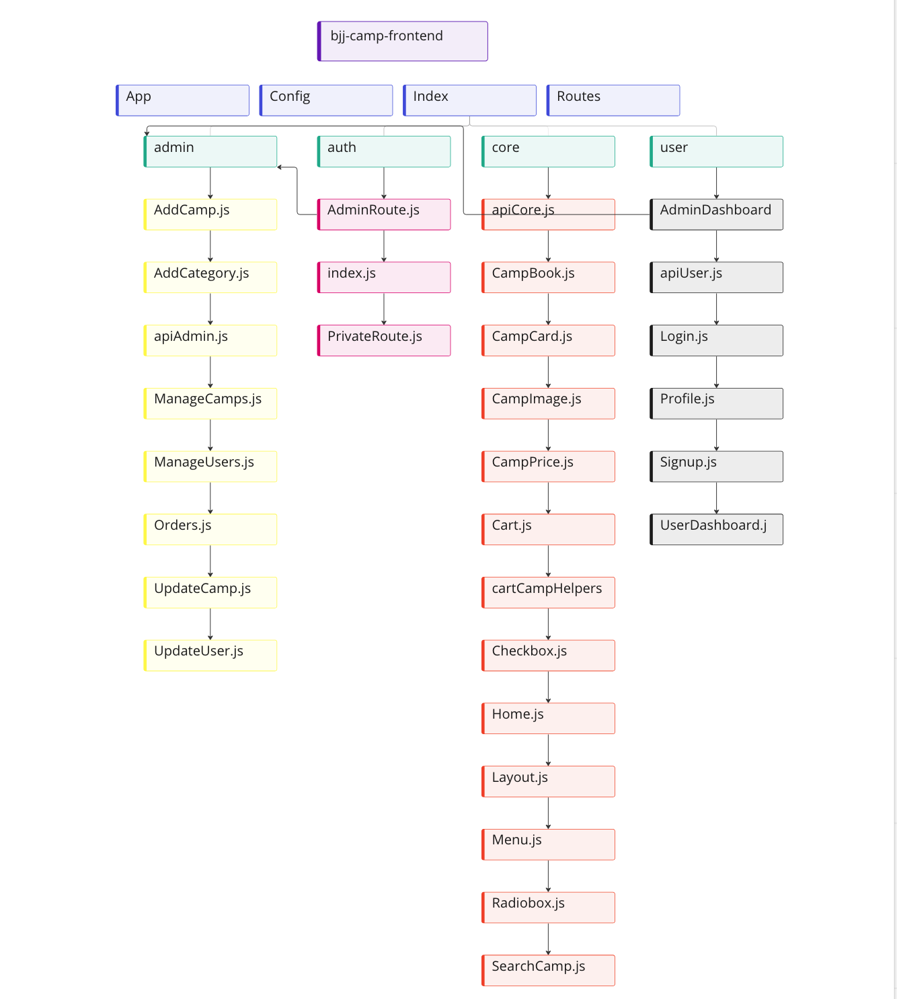

<h1 align='center'>Brazilian Jiu-Jitsu Camps - backend | MERN application</h1>
<br />
<h3>Project information</h3>
<br />
<p align='center'>My goal with this project was to allow the BJJ interested people to book training camps in different parts of the world. Based on their belt degree, and the amount of money they want to pay. The project is also implemented with Paypal and VISA system using braintree API. A user can book, filter, search camps. A user can also login, register and browse certain parts of the webpage without having to create an account. There is also an Admin route, where the admin can delete or add a camp. An admin is also authorized to delete or update a user. For example, an admin can upgrade a user from white to blue belt. </p>
<br />

<h4>Project links</h4>
<a href="https://bjj-camps.netlify.app" target="_blank">Live App</a> | <a href="https://github.com/onurkayhann/bjj-camp-frontend" target="_blank">Frontend Repo for the App</a>  | <a href="https://github.com/onurkayhann/bjj-camp-backend" target="_blank">Backend Repo for the App</a> | <a href="https://www.figma.com/file/ptLf36k5QMRNGDQConA9AY/u09-fullstack-project?node-id=0%3A1" target="_blank">Figma work</a> | <a href="https://docs.google.com/document/d/1Xw3Oq3rEVeF-vSE9ItOklfLu34bz1IKPrZkm5GKRyr4/edit" target="_blank">Interviews</a> | <a href="https://docs.google.com/document/d/14vXOq5Yp2ya-JlO1_fkgj6u9mUudmgGWu6q3Rm2TWzY/edit" target="_blank">Backlog</a> | <a href='https://github.com/onurkayhann?tab=projects' target='_blank'>Sprints</a>

### Used languages to create this App

- [React.js](https://reactjs.org/)
- [Bootstrap](https://getbootstrap.com/)
- [CSS](https://css-tricks.com/)
- [NodeJS](https://nodejs.org/en/)
- [ExpressJS](https://expressjs.com/)
- [MongoDB](https://www.mongodb.com/)

## Deployment

Frontend is deployed with Netlify, and the backend is deployed using Render. I used Render's free plan, the only con is that it will spun down after 15 minutes of inactivity. But once a new request is received, Render will kick in again and start the process in approximately 30 seconds.

## How to get started with the app

### Installation steps

1. Clone the repo
   ```sh
   git clone https://github.com/onurkayhann/bjj-camp-frontend
   ```
2. Install NPM packages (In the client and server folders)
   ```sh
   npm install
   ```
3. Create your .env
   ```JS
   REACT_APP_API_URL=http://localhost:8000/api
   ...
   ```
4. Run
   ```sh
   npm start
   ```

## Sitemap for frontend



## Fulfilled requirements

- RESTful API
- Responsiveness
- User Register, Login, and Logout
- User can search in the search field
- User can filter through prices and belt degrees
- Users can use PayPal or VISA to pay for their bookings

## Test

I used Mocha, Mocha-Http, Chai, and Chai-Http to test some important routes on the backend. Everything is documentated and can be reached in the test map, on the backend.

## License

MIT license

## Thanks to providers

I am super grateful that some people from the UX Designer program participated in my pre-work, and allowed me, to interview them. Thank you Victoria, Isabel, Neda, and Sandra.

## About the Author

My name is Onur, I am born and raised in Sweden, Stockholm. I am a code geek that always wants to learn about the coding, algorithms, and everything related to code. On my spare time I love reading books, learn Brazilian Jiu-Jitsu, travel, and explore different cultures.

## Get in touch with me

Email - onur.kayhan@chasacademy.se
<br />
LinkedIn: [Onur Kayhan](https://www.linkedin.com/in/onur-kayhan-02b770234/)
<br />
[My website](https://onur-portfolio.netlify.app/)
